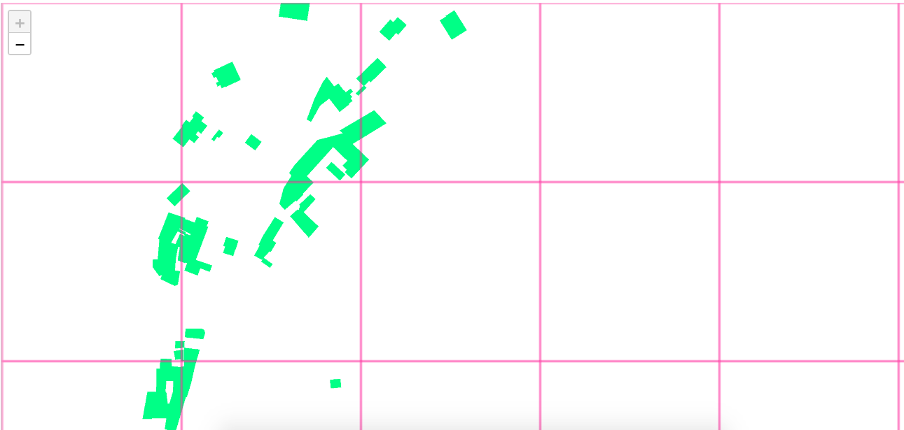
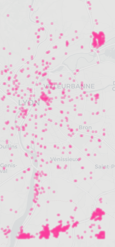

# From OpenData to OpenDataSet


Context:
-------

In supervised learning, you can't expect to obtain a good trained model from inacurate labels: Garbage In, Garbage Out. Data preparation, however, can be tedious if you don't use efficient enough abstract tools. 

Even though OpenData datasets are widely available, those reliable enough to be used verbatim to train decents models are still scarse. Even with state of art model training algorithms, best results are only achieved by people who can afford to tag manually, with pixel accuracy, their own datasets.

So how can we load and qualify OpenData sets in order to create our own training samples? That’s what this tutorial is about!


Retrieve OpenData:
------------------

We decided to use OpenData from <a href="https://rdata-grandlyon.readthedocs.io/en/latest/">the Grand Lyon metropole</a> because it offers to download recent imagery and several vector layers through standard web services.


The first step is to set the spatial extent and the <a href="https://wiki.openstreetmap.org/wiki/Zoom_levels">zoom level</a>:

```
rsp cover --zoom 18 --type bbox 4.795,45.628,4.935,45.853  ~/rsp_dataset/cover
```


To download imagery using <a href="https://www.opengeospatial.org/standards/wms">WMS</a>:

```
rsp download --type WMS 'https://download.data.grandlyon.com/wms/grandlyon?SERVICE=WMS&REQUEST=GetMap&VERSION=1.3.0&LAYERS=Ortho2015_vue_ensemble_16cm_CC46&WIDTH=512&HEIGHT=512&CRS=EPSG:3857&BBOX={xmin},{ymin},{xmax},{ymax}&FORMAT=image/jpeg' --web_ui --format jpeg ~/rsp_dataset/cover ~/rsp_dataset/images
```

NOTA:
- Retina resolution of 512px is preferred to a regular 256px, because it improves the training accuracy. 
- Relaunch this command in case of download error, till the whole coverage is downloaded.
- Jpeg is preferred over default webp only because a few browsers still not handle the webp format.


<a href="http://www.datapink.tools/rsp/opendata_to_opendataset/images/"></a>


Then to download buildings’ vector roofprints with <a href="https://www.opengeospatial.org/standards/wfs">WFS</a>, 

```
wget -O ~/rsp_dataset/lyon_roofprint.json 'https://download.data.grandlyon.com/wfs/grandlyon?SERVICE=WFS&REQUEST=GetFeature&TYPENAME=ms:fpc_fond_plan_communaut.fpctoit&VERSION=1.1.0&srsName=EPSG:4326&outputFormat=application/json; subtype=geojson'
```

Roofprint choice is important here, as we use aerial imagery to retrieve patterns. If we used the buildings' footprints instead, the training accuracy would be poorer.


Prepare DataSet
----------------

Now to transform the vector roofprints and raster labels:

```
wget https://raw.githubusercontent.com/datapink/robosat.pink/master/config.toml
rsp rasterize --config config.toml --geojson ~/rsp_dataset/lyon_roofprint.json --web_ui ~/rsp_dataset/cover ~/rsp_dataset/labels
```

<a href="http://www.datapink.tools/rsp/opendata_to_opendataset/labels/"></a>


Then to create a training / validation dataset, with imagery and related roofprint labels:

```
mkdir ~/rsp_dataset/training ~/rsp_dataset/validation

cat ~/rsp_dataset/cover | sort -R >  ~/rsp_dataset/cover.shuffled
head -n 16384 ~/rsp_dataset/cover.shuffled > ~/rsp_dataset/training/cover
tail -n 7924  ~/rsp_dataset/cover.shuffled > ~/rsp_dataset/validation/cover

rsp subset --web_ui --dir ~/rsp_dataset/images --cover ~/rsp_dataset/training/cover --out ~/rsp_dataset/training/images
rsp subset --web_ui --dir ~/rsp_dataset/labels --cover ~/rsp_dataset/training/cover --out ~/rsp_dataset/training/labels
rsp subset --web_ui --dir ~/rsp_dataset/images --cover ~/rsp_dataset/validation/cover --out ~/rsp_dataset/validation/images
rsp subset --web_ui --dir ~/rsp_dataset/labels --cover ~/rsp_dataset/validation/cover --out ~/rsp_dataset/validation/labels
```

Two points to emphasise here:
 - It's a good idea to pick enough data for the validation part (here we took a 70/30 ratio).
 - The shuffle step helps to offset spatial bias in training/validation sets.


Train
-----

Now to launch a first model training:

```
rsp train --config config.toml ~/rsp_dataset/pth
```

After ten epochs only, the building IoU metric on validation dataset is about **0.82**. 
It's already a fair result for the state of art processing with real world data, but we will see how to improve it.


Predictive masks
----------------

To create predictive masks from our first model, on the entire coverage:

```
rsp predict --config config.toml --checkpoint ~/rsp_dataset/pth/checkpoint-00010-of-00010.pth --web_ui ~/rsp_dataset/images ~/rsp_dataset/masks
```

<a href="http://www.datapink.tools/rsp/opendata_to_opendataset/masks/"></a>


Compare
-------

Then to assess how our first model behaves with this raw data, we compute a composite stack image with imagery, label and predicted mask.

The colour of the patches means:
 - pink: predicted by the model (but not present in the initial labels)
 - green: present in the labels (but not predicted by the model)
 - grey: both model prediction and labels agree.


```
rsp compare --images ~/rsp_dataset/images ~/rsp_dataset/labels ~/rsp_dataset/masks --mode stack --labels ~/rsp_dataset/labels --masks ~/rsp_dataset/masks --config config.toml --format jpeg --web_ui ~/rsp_dataset/compare

rsp compare --mode list --labels ~/rsp_dataset/labels --maximum_qod 80 --minimum_fg 5 --masks ~/rsp_dataset/masks --config config.toml --geojson ~/rsp_dataset/compare/tiles.json
```

<a href="http://www.datapink.tools/rsp/opendata_to_opendataset/compare/"></a>

We also run a csv list diff, in order to pick tiles with a low Quality of Data metric (here below 80% on QoD metric) and with at least a handful of buildings' pixels assumed to lie within the tile (5% of foreground building at minimum).

If we zoom back on the map, we can see tiles matching the previous filters:





It is obvious that some areas are not labelled correctly in the original OpenData, so we ought to remove them from the training and validation dataset.

To do so, first step is to select the wrongly labelled tiles. The "compare" tool is again helpful,
as it allows to check several tiles side by side, and to manually select those we want to keep.

```
rsp compare --mode side --images ~/rsp_dataset/images ~/rsp_dataset/compare --labels ~/rsp_dataset/labels --maximum_qod 80 --minimum_fg 5 --masks ~/rsp_dataset/masks --config config.toml --format jpeg --web_ui ~/rsp_dataset/compare_side
```

<a href="http://www.datapink.tools/rsp/opendata_to_opendataset/compare_side/"></a>


Filter
------

The compare selection produces a csv cover list into the clipboard.
We store the result in `~rsp_dataset/cover.to_remove`

Then we just remove all the tiles from the dataset:
```
rsp subset --mode delete --dir ~/rsp_dataset/training/images --cover ~/rsp_dataset/cover.to_remove > /dev/null
rsp subset --mode delete --dir ~/rsp_dataset/training/labels --cover ~/rsp_dataset/cover.to_remove > /dev/null
rsp subset --mode delete --dir ~/rsp_dataset/validation/images --cover ~/rsp_dataset/cover.to_remove > /dev/null
rsp subset --mode delete --dir ~/rsp_dataset/validation/labels --cover ~/rsp_dataset/cover.to_remove > /dev/null
```

For information, we remove about 500 tiles from this raw dataset in order to clean up obvious inconsistent labelling.


Train 
-----

Having a cleaner training and validation dataset, we can launch a new and longer training:

```
rsp train --config config.toml --epochs 100 ~/rsp_dataset/pth_clean
```

Building IoU metrics on validation dataset:
 - After 10  epochs: **0.84** 
 - After 100 epochs: **0.87**
 
 

Predict and compare
-------------------

And now to generate masks prediction, and compare composite images, as previously done:

```
rsp predict --config config.toml --checkpoint ~/rsp_dataset/pth_clean/checkpoint-00100-of-00100.pth ~/rsp_dataset/images ~/rsp_dataset/masks_clean

rsp compare --images ~/rsp_dataset/images ~/rsp_dataset/labels ~/rsp_dataset/masks_clean --mode stack --labels ~/rsp_dataset/labels --masks ~/rsp_dataset/masks_clean --config config.toml --web_ui --format jpeg ~/rsp_dataset/compare_clean

rsp compare --mode list --labels ~/rsp_dataset/labels --maximum_qod 80 --minimum_fg 5 --masks ~/rsp_dataset/masks_clean --config config.toml --geojson ~/rsp_dataset/compare_clean/tiles.json
```

<a href="http://www.datapink.tools/rsp/opendata_to_opendataset/compare_clean/"></a>


And to compare only with filtered validation tiles, in side by side mode: 

```
rsp cover --type dir ~/rsp_dataset/validation/images  ~/rsp_dataset/validation/cover.clean

rsp subset --dir ~/rsp_dataset/compare_clean --cover ~/rsp_dataset/validation/cover.clean --out ~/rsp_dataset/validation/compare_clean

rsp subset --dir ~/rsp_dataset/masks_clean --cover ~/rsp_dataset/validation/cover.clean --out ~/rsp_dataset/validation/masks_clean

rsp compare --mode side --images ~/rsp_dataset/validation/images ~/rsp_dataset/validation/compare_clean --labels ~/rsp_dataset/validation/labels --masks ~/rsp_dataset/validation/masks_clean --config config.toml --web_ui --format jpeg ~/rsp_dataset/validation/compare_side_clean
```

<a href="http://www.datapink.tools/rsp/opendata_to_opendataset/compare_side_clean/"></a>
