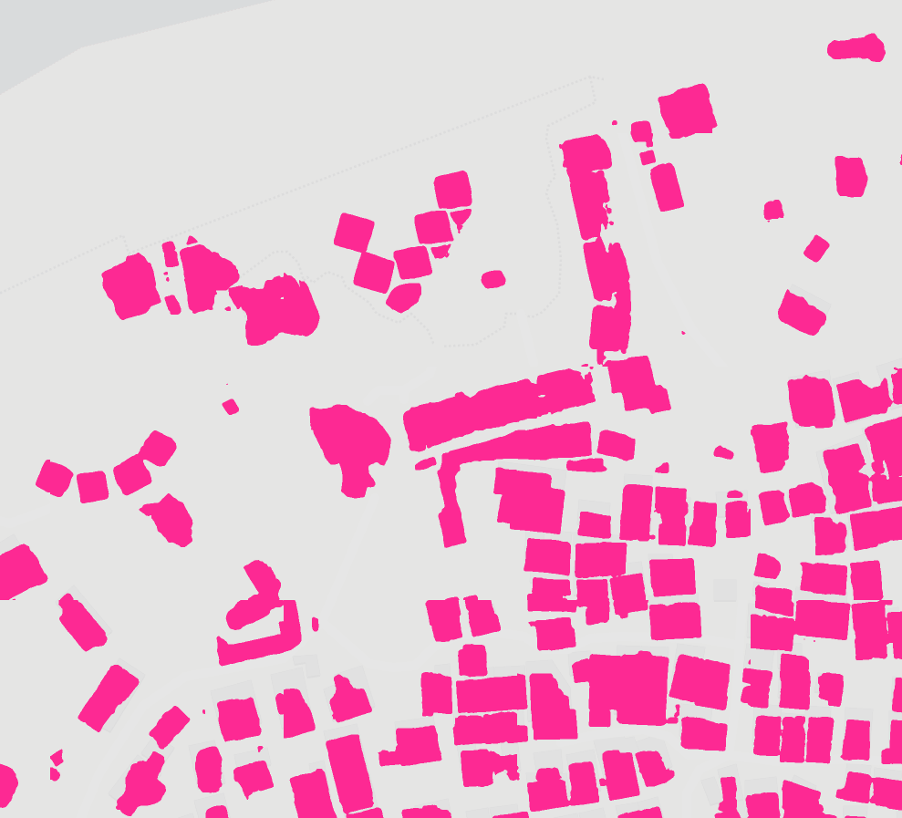
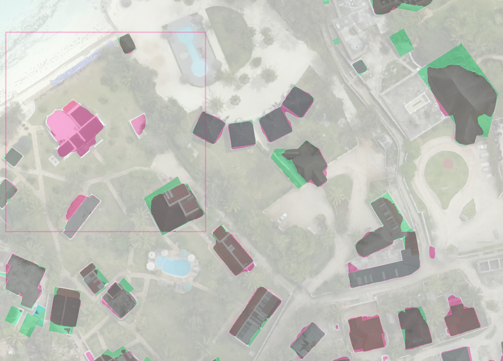
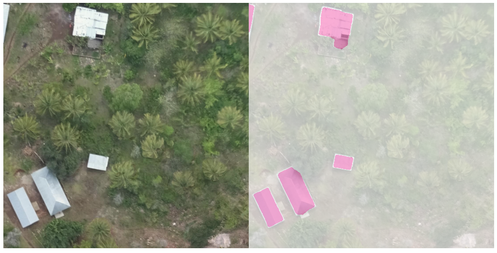

# Quality Analysis


Context and motivations:
-----------------------


Configuration file:
-------------------

```bash
echo '
[[channels]]
  name   = "images"
  bands = [1, 2, 3]

[[classes]]
  title = "Building"
  color = "deeppink"

[model]
  nn = "Albunet"
  loss = "Lovasz"
  loader = "SemSegTiles"
  da = "Strong"
  metrics = ["iou"]

' > tanzania.toml
```


Retrieve and tile Imagery:
--------------------------

```bash
mkdir ds
wget -nc -nv --show-progress -O ds/grid_001.tif https://oin-hotosm.s3.amazonaws.com/5afeda152b6a08001185f11a/0/5afeda152b6a08001185f11b.tif
wget -nc -nv --show-progress -O ds/grid_022.tif https://oin-hotosm.s3.amazonaws.com/5ae242fd0b093000130afd26/0/5ae242fd0b093000130afd27.tif
wget -nc -nv --show-progress -O ds/grid_023.tif https://oin-hotosm.s3.amazonaws.com/5ae242fd0b093000130afd46/0/5ae242fd0b093000130afd47.tif
wget -nc -nv --show-progress -O ds/grid_028.tif https://oin-hotosm.s3.amazonaws.com/5ae242fd0b093000130afd34/0/5ae242fd0b093000130afd35.tif
wget -nc -nv --show-progress -O ds/grid_029.tif https://oin-hotosm.s3.amazonaws.com/5ae242fd0b093000130afd38/0/5ae242fd0b093000130afd39.tif
wget -nc -nv --show-progress -O ds/grid_035.tif https://oin-hotosm.s3.amazonaws.com/5ae242fd0b093000130afd42/0/5ae242fd0b093000130afd43.tif
wget -nc -nv --show-progress -O ds/grid_036.tif https://oin-hotosm.s3.amazonaws.com/5ae242fd0b093000130afd40/0/5ae242fd0b093000130afd41.tif
wget -nc -nv --show-progress -O ds/grid_042.tif https://oin-hotosm.s3.amazonaws.com/5ae318220b093000130afd64/0/5ae318220b093000130afd65.tif
wget -nc -nv --show-progress -O ds/grid_043.tif https://oin-hotosm.s3.amazonaws.com/5ae318220b093000130afd6a/0/5ae318220b093000130afd6b.tif
wget -nc -nv --show-progress -O ds/grid_049.tif https://oin-hotosm.s3.amazonaws.com/5ae318220b093000130afd62/0/5ae318220b093000130afd63.tif
wget -nc -nv --show-progress -O ds/grid_050.tif https://oin-hotosm.s3.amazonaws.com/5ae318220b093000130afd92/0/5ae318220b093000130afd93.tif
wget -nc -nv --show-progress -O ds/grid_051.tif https://oin-hotosm.s3.amazonaws.com/5ae318220b093000130afd70/0/5ae318220b093000130afd71.tif
wget -nc -nv --show-progress -O ds/grid_058.tif https://oin-hotosm.s3.amazonaws.com/5ae318220b093000130afd7c/0/5ae318220b093000130afd7d.tif
```

```bash
rsp tile --zoom 19 --nodata_threshold 10 ds/*tif ds/images
rsp cover --dir ds/images ds/images/cover
```
<a href="http://www.datapink.tools/rsp/quality_analysis/ds/images/"></a>


Retrieve and tile labels:
-------------------------

```bash
wget -nc -nv --show-progress \
https://www.dropbox.com/sh/ct3s1x2a846x3yl/AAARCAOqhcRdoU7ULOb9GJl9a/grid_001.geojson \
https://www.dropbox.com/sh/ct3s1x2a846x3yl/AADtSLtWlp1WWBzok4j8QDtTa/grid_022.geojson \
https://www.dropbox.com/sh/ct3s1x2a846x3yl/AAAvAgdJLgURi6y0V_R7b77Na/grid_023.geojson \
https://www.dropbox.com/sh/ct3s1x2a846x3yl/AAAQlsJdp4WYiUwfd0o4mqoNa/grid_028.geojson \
https://www.dropbox.com/sh/ct3s1x2a846x3yl/AADHytc8fSCf3gna0wNAW3lZa/grid_029.geojson \
https://www.dropbox.com/sh/ct3s1x2a846x3yl/AADsRwTo35luDWb4FcKhAotaa/grid_035.geojson \
https://www.dropbox.com/sh/ct3s1x2a846x3yl/AABX9puJlaKE25JJ9YAkF-Bta/grid_036.geojson \
https://www.dropbox.com/sh/ct3s1x2a846x3yl/AACAIX76YnY7YF-qqJ_4NBPwa/grid_042.geojson \
https://www.dropbox.com/sh/ct3s1x2a846x3yl/AADYKa21pfgqygaPI7-k_Gp7a/grid_043.geojson \
https://www.dropbox.com/sh/ct3s1x2a846x3yl/AADTfD4iO7iShsBU_DI3vsaga/grid_049.geojson \
https://www.dropbox.com/sh/ct3s1x2a846x3yl/AABBphDWEHz71zdoeNYRAyeha/grid_050.geojson \
https://www.dropbox.com/sh/ct3s1x2a846x3yl/AACjRwga-dJY1dud1Kfq64Fsa/grid_051.geojson \
https://www.dropbox.com/sh/ct3s1x2a846x3yl/AADY5M0XSZphjFNfwmFli_baa/grid_058.geojson
mv grid_*.geojson ds
```


```bash
# Import Labels into PostGIS
sudo su postgres -c 'createdb tanzania'
sudo su postgres -c 'psql -c "CREATE EXTENSION postgis" tanzania'
sudo su postgres -c "psql -c \"CREATE USER rsp WITH PASSWORD 'pass' \""

for geojson in `ls ds/grid_*.geojson`
do
        ogr2ogr -f "PostgreSQL" PG:"user=rsp host=localhost dbname=tanzania password=pass" $geojson -t_srs EPSG:3857 -nlt PROMOTE_TO_MULTI -nln building -lco GEOMETRY_NAME=geom -append
done

sudo su postgres -c 'psql -c "UPDATE building SET geom=ST_MakeValid(geom) WHERE NOT ST_IsValid(geom)" tanzania'


# Generate Labels
rsp rasterize --pg "user=rsp host=localhost password=pass dbname=tanzania" --sql "SELECT ST_Buffer(geom, -0.25) FROM building WHERE condition IN ('Complete', 'Incomplete') AND ST_Intersects(TILE_GEOM, geom)" --type Building --config tanzania.toml --cover ds/images/cover ds/labels
```
<a href="http://www.datapink.tools/rsp/quality_analysis/ds/labels/"></a>


Create a Training DataSet:
-------------------------

```bash
# Create Training DataSet
awk '$2 > 0 { print $1 }' ds/labels/instances_building.cover > ds/instances.cover
awk '$2 == 0 { print $1 }' ds/labels/instances_building.cover > ds/no_instance.cover
sort -R ds/no_instance.cover | head -n 4000 > ds/no_instance_subset.cover
cat ds/instances.cover ds/no_instance_subset.cover > ds/cover

rsp cover --cover ds/cover --splits 90/10 ds/training/cover ds/validation/cover
rsp subset --dir ds/images --cover ds/training/cover ds/training/images
rsp subset --dir ds/labels --cover ds/training/cover ds/training/labels
rsp subset --dir ds/images --cover ds/validation/cover ds/validation/images
rsp subset --dir ds/labels --cover ds/validation/cover ds/validation/labels
```


Train, and predict:
------------------
```bash
rsp train --config tanzania.toml --epochs 10 --bs 4 --lr 0.000025 ds ds/pth

rsp predict --config tanzania.toml --checkpoint ds/pth/checkpoint-00010.pth ds ds/masks
```
<a href="http://www.datapink.tools/rsp/quality_analysis/ds/masks/"></a>


Compare predicted masks against labels:
---------------------------------------
```bash
rsp compare --images ds/images ds/masks ds/labels --mode stack ds/compare
rsp compare --mode list --geojson --labels ds/labels --masks ds/masks --maximum_qod 80 ds/compare/tiles.json
rsp compare --mode side --images ds/images ds/compare --labels ds/labels --masks ds/masks --maximum_qod 80 ds/compare_side
```
<a href="http://www.datapink.tools/rsp/quality_analysis/ds/compare/"></a>
<a href="http://www.datapink.tools/rsp/quality_analysis/ds/compare_side/"></a>


Retriveve and tile Predict Imagery:
----------------------------------
```bash
mkdir predict
wget -nc -nv --show-progress -O predict/grid_034.tif https://oin-hotosm.s3.amazonaws.com/5ae242fd0b093000130afd32/0/5ae242fd0b093000130afd33.tif
wget -nc -nv --show-progress -O predict/grid_047.tif https://oin-hotosm.s3.amazonaws.com/5b00370f2b6a08001185f125/3/5b00370f2b6a08001185f129.tif
wget -nc -nv --show-progress -O predict/grid_067.tif https://oin-hotosm.s3.amazonaws.com/5ae318220b093000130afd98/0/5ae318220b093000130afd99.tif
wget -nc -nv --show-progress -O predict/grid_074.tif https://oin-hotosm.s3.amazonaws.com/5b00370f2b6a08001185f125/5/5b00370f2b6a08001185f12b.tif
wget -nc -nv --show-progress -O predict/grid_076.tif https://oin-hotosm.s3.amazonaws.com/5ae36dd70b093000130afdba/0/5ae36dd70b093000130afdbb.tif
wget -nc -nv --show-progress -O predict/grid_135.tif https://oin-hotosm.s3.amazonaws.com/5ae38a540b093000130aff23/0/5ae38a540b093000130aff24.tif
wget -nc -nv --show-progress -O predict/grid_181.tif https://oin-hotosm.s3.amazonaws.com/5ae38a540b093000130afecf/0/5ae38a540b093000130afed0.tif
wget -nc -nv --show-progress -O predict/grid_059.tif https://oin-hotosm.s3.amazonaws.com/5ae318220b093000130afd78/0/5ae318220b093000130afd79.tif
wget -nc -nv --show-progress -O predict/grid_066.tif https://oin-hotosm.s3.amazonaws.com/5ae318220b093000130afd94/0/5ae318220b093000130afd95.tif

# Tile Imagery
rsp tile --zoom 19 --nodata_threshold 10 predict/*tif predict/images
rsp cover --dir predict/images predict/images/cover
```
<a href="http://www.datapink.tools/rsp/quality_analysis/predict/images/"></a>


Retrieve OSM data:
------------------
```bash
mkdir osm
wget -nc -nv --show-progress -O osm/tanzania.pbf https://download.geofabrik.de/africa/tanzania-latest.osm.pbf
osmium extract --bbox 39.017258,-5.708914,39.765701,-6.588899 -o osm/zanzibar.pbf osm/tanzania.pbf
rsp extract --type Building osm/zanzibar.pbf osm/buildings.json
rsp rasterize --config tanzania.toml --geojson osm/buildings.json --cover predict/images/cover --type Building predict/osm
```
<a href="http://www.datapink.tools/rsp/quality_analysis/predict/osm/"></a>


Predict and compare against OSM:
--------------------------------
```
rsp predict --config tanzania.toml --checkpoint ds/pth/checkpoint-00010.pth predict predict/masks

rsp compare --images predict/images predict/osm predict/masks --mode stack predict/compare
rsp compare --mode list --geojson --labels predict/osm --masks predict/masks --maximum_qod 80 predict/compare/tiles.json
rsp compare --mode side --images predict/images predict/compare --labels predict/osm --masks predict/masks --maximum_qod 80 predict/compare_side
```
<a href="http://www.datapink.tools/rsp/quality_analysis/predict/compare/"></a>
<a href="http://www.datapink.tools/rsp/quality_analysis/predict/compare_side/"></a>


Vectorize prediction masks:
---------------------------
```bash
rsp vectorize --config tanzania.toml --type Building predict/masks building.json
ogr2ogr -f "PostgreSQL" PG:"user=rsp host=localhost dbname=tanzania password=pass" building.json -nlt PROMOTE_TO_MULTI -nln predict_building -lco GEOMETRY_NAME=geom
```
